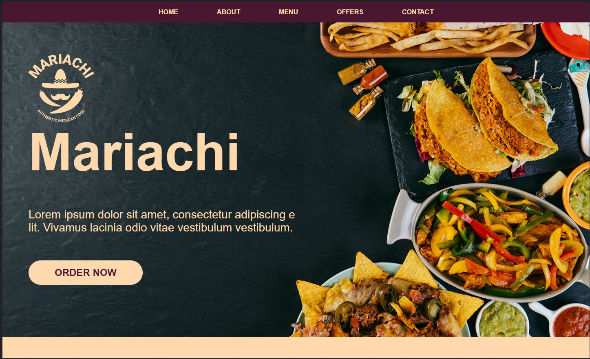
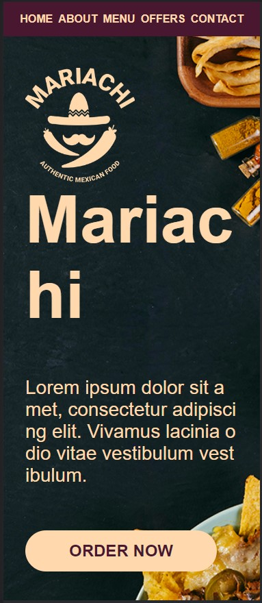

## Mexican Food Dishes Homepage

## Setup

1. `yarn install`
2. `yarn dev`

## Table of contents

- [Overview](#overview)
- [Screenshot](#screenshot)
- [Built with](#built-with)
- [Live Demo](#live-demo)
- [Author](#author)

## Overview

### Screenshot

### Built with

- Semantic HTML5 markup
- CSS custom properties
- Flexbox
- CSS Grid
- Mobile-first workflow
- [React](https://reactjs.org/) - JS library

### Live Demo

- Live Site URL: [Live Demo](https://origo-assignment.netlify.app/)

### Author

- Website - [https://shnitish.me/](https://shnitish.me/)
