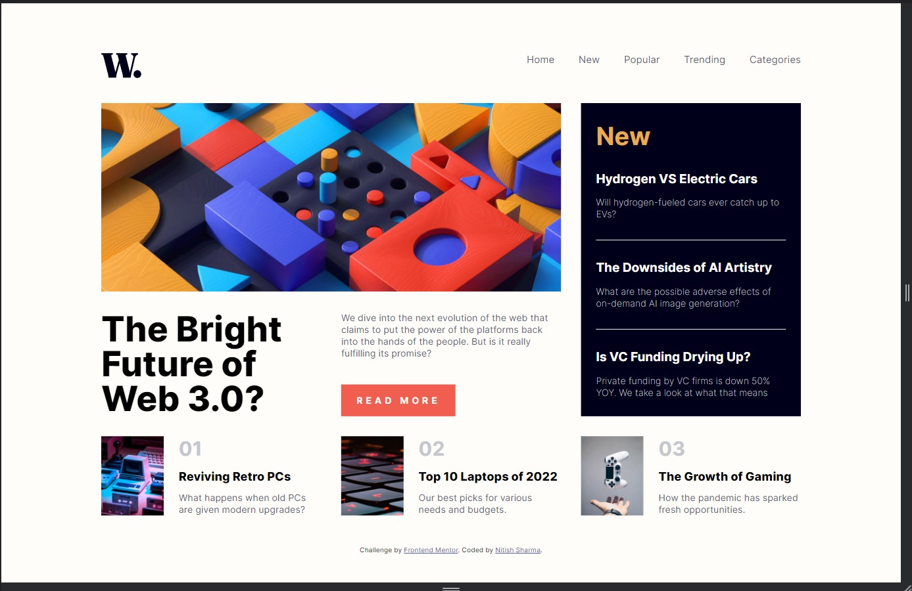
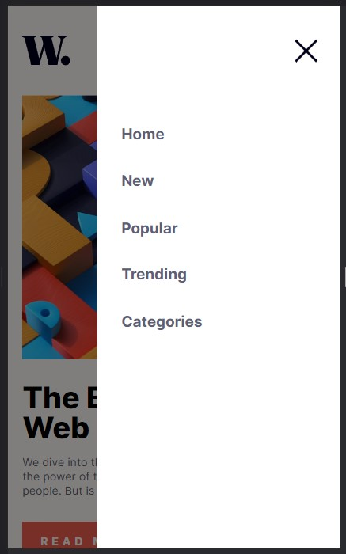

# Frontend Mentor - News homepage solution

This is a solution to the [News homepage challenge on Frontend Mentor](https://www.frontendmentor.io/challenges/news-homepage-H6SWTa1MFl). Frontend Mentor challenges help you improve your coding skills by building realistic projects.

## Table of contents

- [Overview](#overview)
  - [The challenge](#the-challenge)
  - [Screenshot](#screenshot)
  - [Links](#links)
- [My process](#my-process)
  - [Built with](#built-with)
- [Author](#author)

## Overview

### The challenge

Users should be able to:

- View the optimal layout for the interface depending on their device's screen size
- See hover and focus states for all interactive elements on the page

### Screenshot

### Links

- Solution URL: [Solution](https://github.com/shnitish/frontend-mentor-challenges/tree/main/news-homepage-main)
- Live Site URL: [Live Demo](https://fem-news-component.netlify.app/)

## My process

### Built with

- Semantic HTML5 markup
- CSS custom properties
- Flexbox
- CSS Grid

## Author

- Website - [Nitish Sharma](https://shnitish.me/)
- Frontend Mentor - [@yourusername](https://www.frontendmentor.io/profile/shnitish)
- Linkedin - [@shnitish](https://www.linkedin.com/in/shnitish)

## Todo

- [x] Implment overlay menu for mobile screen
- [x] handle close/open action of menu in mobile screen
