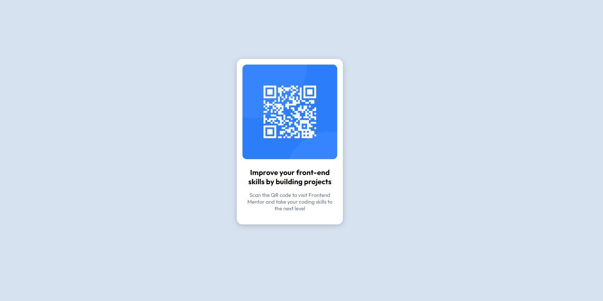

# Frontend Mentor - QR code component solution

This is a solution to the [QR code component challenge on Frontend Mentor](https://www.frontendmentor.io/challenges/qr-code-component-iux_sIO_H). Frontend Mentor challenges help you improve your coding skills by building realistic projects.

## Table of contents

- [Overview](#overview)
  - [Screenshot](#screenshot)
  - [Links](#links)
- [My process](#my-process)
  - [Built with](#built-with)
- [Author](#author)

**Note: Delete this note and update the table of contents based on what sections you keep.**

## Overview

### Screenshot

### Links

- Solution URL: [Solution](https://github.com/shnitish/frontend-mentor-challenges/tree/main/qr-code-component-main)
- Live Site URL: [Live Demo](https://creative-frangipane-1649a3.netlify.app/)

## My process

### Built with

- Semantic HTML5 markup
- CSS custom properties
- Flexbox

## Author

- Website - [Nitish Sharma](https://shnitish.me/)
- Frontend Mentor - [@shnitish](https://www.frontendmentor.io/profile/shnitish)
- Linkedin - [@shnitish](https://www.linkedin.com/in/shnitish/)
